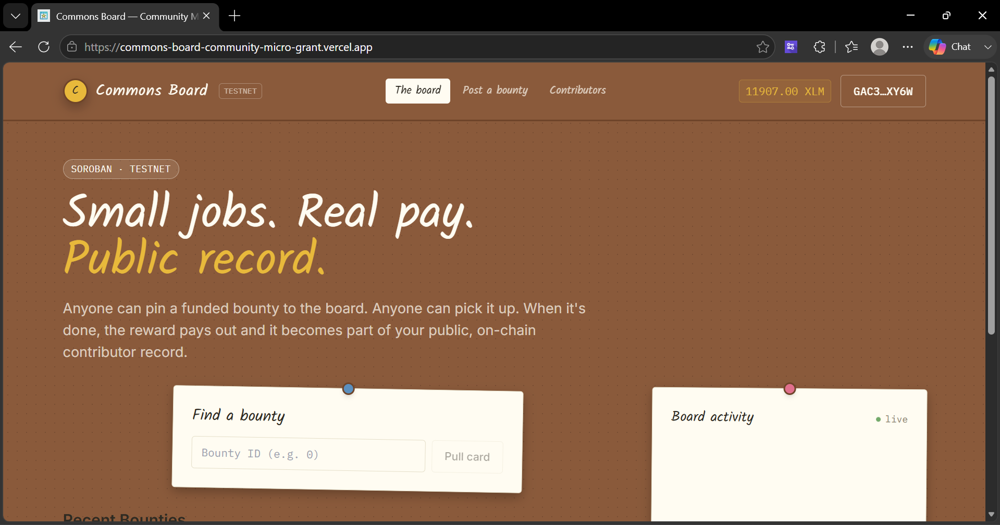

<div align="center">
  
# 📌 Commons Board - Community Micro-Grants on Stellar Soroban

**A public corkboard of funded bounties built on Soroban smart contracts.**  
*Commons Board makes public-goods micro-funding fully on-chain, verifiable, and tied to a permanent contributor reputation registry.*

[](https://stellar.org/soroban)
[](https://vitejs.dev/)
[](https://commons-board-community-micro-grant.vercel.app/)

### 🔗 Links
- **Live App**: [commons-board-community-micro-grant.vercel.app](https://commons-board-community-micro-grant.vercel.app/)
- **Demo Video**: [Watch the Demo](https://drive.google.com/file/d/1q1G3JvicsdyH0mcXVHun-QAfGFCMxoQy/view?usp=sharing)
- **Example Tx (Post Bounty)**: [`a3b7...c8b`](https://stellar.expert/explorer/testnet/tx/a3b704e4557111d3e3342e08f71bf15efb272aef139adb60b1bbc569aa9c2c8b)
- **Example Tx (Approve & Payout)**: [`812a...f5b`](https://stellar.expert/explorer/testnet/tx/812a3bf99835d159c2ea25aa35d215a070c614cc2b7a3e1decff08c111f5af5b)



</div>

<br />

## ✅ Submission Checklist

- [x] **Public GitHub repository**: You are here!
- [x] **README with complete documentation**: See architecture and instructions below.
- [x] **Minimum 10+ meaningful commits**: See [commit history](https://github.com/khushi706-g/Commons-Board-Community-Micro-Grants-on-Stellar-Soroban/commits).
- [x] **Live demo link (Vercel)**: Linked at the top of this README.
- [x] **Contract deployment address**: See [Smart Contract Deployment](#-smart-contract-deployment-stellar-testnet) section.
- [x] **Transaction hash**: Provided in the [Links](#-links) section above.
- [x] **Screenshot showing Mobile responsive UI**: See [Platform Gallery](#-platform-gallery).
- [x] **Screenshot showing CI/CD pipeline running**: See [Platform Gallery](#-platform-gallery).
- [x] **Screenshot showing Test output with 3+ passing tests**: See [Platform Gallery](#-platform-gallery).
- [x] **Demo video link (1–2 minutes)**: Linked in the [Links](#-links) section above.

---

## 🌟 Key Features

1. **Upfront Escrow:** The reward is escrowed the moment the bounty is posted, not just promised — contributors know the money is already there before doing any work.
2. **Independent Reputation Registry:** BountyBoard and ContributorRegistry are separate contracts. The board owns bounty lifecycle, while the registry is an independent, cumulative record of a person's contributions across every bounty they've ever completed.
3. **Real-time Event Streaming:** Every state change (posted, submitted, paid, cancelled) emits an event, streamed live into the frontend's activity ticker. 
4. **Reward-Tiered Scoring:** A contributor who does one $500 job and one who does five $50 jobs both build real reputation, just along different signals anyone can inspect.

---

## 📸 Platform Gallery

Here is a look at the platform in action, alongside our automated CI/CD pipeline and test suite:

### Responsive UI & Core Features

<br/>


### Automated CI/CD & Testing

<br/>


---

## 🚀 Smart Contract Deployment (Stellar Testnet)

The smart contracts are live and deployed to the **Stellar Testnet** via automated CI/CD (GitHub Actions).

| Contract | Contract ID | Explorer |
|---|---|---|
| 📋 **BountyBoard** | `CC3N2CZNWMO7EQNVLJ4FA5MSQ7RQN5NTFENAHUIY5B2PPCFLWNTO2ZA6` | [View on Stellar Expert](https://stellar.expert/explorer/testnet/contract/CC3N2CZNWMO7EQNVLJ4FA5MSQ7RQN5NTFENAHUIY5B2PPCFLWNTO2ZA6) |
| 🏅 **ContributorRegistry** | `CAE2C2UQBDDM4E65SMQ6C7ZWDYRDODBQ4PI5JYV2IBC7TYRRVQ6V63SI` | [View on Stellar Expert](https://stellar.expert/explorer/testnet/contract/CAE2C2UQBDDM4E65SMQ6C7ZWDYRDODBQ4PI5JYV2IBC7TYRRVQ6V63SI) |

---

## 🏗️ Architecture

```text
Poster / Contributor
        │
        ▼
 React frontend (corkboard of pinned bounty cards, live activity feed)
        │
        ▼
 BountyBoard contract ──────► Token contract (reward deposit & payout)
        │
        └──────────────────► ContributorRegistry contract (log_completion, called on payout)
```

**Inter-contract communication**: The BountyBoard contract's `approve_submission` calls into ContributorRegistry's `log_completion` immediately after paying the winner. The ContributorRegistry requires `board.require_auth()`, ensuring only the authorized BountyBoard can write to anyone's contributor record.

---

## 📂 Project Structure

```text
commons-board/
├── contracts/
│   ├── bounty/             # Main contract: post, submit, approve, cancel
│   │   └── src/
│   │       ├── lib.rs
│   │       └── test.rs     # Unit tests
│   └── contributor/        # Score + history, called cross-contract
│       └── src/
│           ├── lib.rs
│           └── test.rs     # Unit tests
├── frontend/
│   ├── src/
│   │   ├── components/      # UI Components
│   │   ├── hooks/           # useWallet, useContractEvents
│   │   └── contracts/       # Soroban client integration
│   └── package.json
├── scripts/
│   ├── deploy.sh                # Deploys + initializes both contracts
│   └── sample_interaction.sh    # Posts a demo bounty
└── .github/workflows/ci.yml     # CI/CD Pipeline
```

---

## ⚙️ Smart Contract Design

### BountyBoard contract (`contracts/bounty`)

| Function | Caller | What it does |
|---|---|---|
| `post_bounty` | Poster | Deposits the full reward up front, opens the bounty |
| `submit_work` | Contributor | Attaches a note/link, moves the bounty into review |
| `approve_submission` | Poster | Pays the winner, then cross-contract call to log the completion |
| `cancel_bounty` | Poster (Open only) | Refunds the poster |

### ContributorRegistry contract (`contracts/contributor`)

| Function | Caller | What it does |
|---|---|---|
| `initialize` | Deployer | Authorizes the one BountyBoard contract permitted to log completions |
| `log_completion` | BountyBoard only | +1/+2/+3 score by reward tier; appends history |
| `get_profile` | Anyone (read) | Returns score, completed count, total earned |
| `get_history` | Anyone (read) | Returns every bounty a contributor has completed |

---

## 💻 Running Locally

### Contracts
Requires Rust + `wasm32-unknown-unknown` target + Stellar CLI.
```bash
rustup target add wasm32-unknown-unknown
cargo install --locked stellar-cli

cargo test --workspace           # Run contract tests
stellar contract build           # Build .wasm files
```

### Frontend
```bash
cd frontend
npm install
npm run dev       # Start local dev server
```

---

## 🚀 Deployment (Testnet)

```bash
stellar keys generate deployer --network testnet --fund
chmod +x scripts/deploy.sh
./scripts/deploy.sh
```
This builds both contracts, deploys them to Stellar Testnet, and links them securely.

---

## 📜 License

MIT
